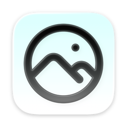
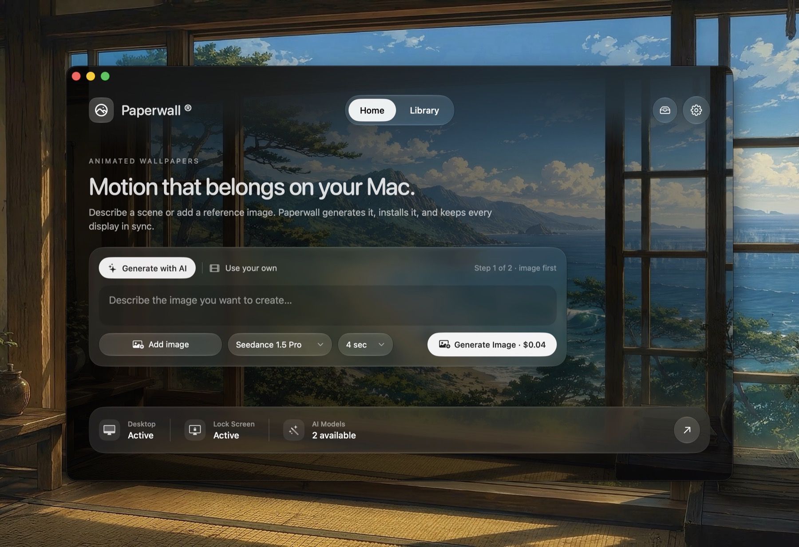

<p align="center">
  
</p>

<h1 align="center">Paperwall ®</h1>

<p align="center">
  <strong>Native animated wallpapers for the macOS desktop and Lock Screen.</strong><br><br>
  Import, create, upscale, organize, and sync cinematic video wallpapers<br>
  from one Swift app, with menu-bar controls and a companion CLI.
</p>

<p align="center">
  <a href="../../releases/latest">
    
  </a>
  
  
  
</p>

> [!WARNING]
> Paperwall uses private, unsupported `WallpaperExtensionKit` APIs for native animated Lock Screen playback. macOS updates may break this integration, and Paperwall is not eligible for Mac App Store distribution.

## Features

- **Native Desktop and Lock Screen playback** — one wallpaper across both macOS surfaces
- **Owned wallpaper library** — import videos without moving or modifying the originals
- **Immersive previews** — browse, inspect metadata, and apply wallpapers from a full-window gallery
- **Optional AI creation** — generate a still image, approve it, then separately approve subtle video animation
- **Automatic 4K preparation** — conservative 2× Real-ESRGAN upscaling for sub-4K videos
- **Resilient recovery** — guarded repair after lock, unlock, sleep, wake, and stale native surfaces
- **Multi-Mac sync** — durable media and metadata designed for Syncthing or another file sync tool
- **Native controls everywhere** — menu-bar app, Settings, Swift CLI, and legacy screen saver fallback
- **Persistent work queue** — generation and upscale jobs survive restarts and resume without duplicate paid requests

## Screenshot

<p align="center">
  
</p>

## Installation

1. Download the latest DMG from [**Releases**](../../releases/latest).
2. Open it and drag **Paperwall** to **Applications**.
3. Launch Paperwall.
4. Select **Paperwall — Video Wallpapers** once in **System Settings → Wallpaper**.
5. Enable **Show as Screen Saver** when offered.

After this one-time native setup, applying a wallpaper in Paperwall updates the Desktop and animated Lock Screen together. Paperwall also installs `paperwall` into `~/.local/bin` and keeps a legacy `Paperwall.saver` fallback.

## Create a wallpaper

Paperwall separates every paid step so nothing is submitted unexpectedly:

1. Describe a scene and explicitly approve image generation.
2. Review the still image.
3. Explicitly approve a slow, subtle, fixed-camera animation.
4. Review the video while Paperwall prepares a resumable 4K version.
5. Apply it to the Desktop and Lock Screen.

Set `REPLICATE_API_TOKEN` in your shell or choose **Configure Replicate Token…** in Paperwall. Paid POST requests are never automatically retried; interrupted jobs resume from their saved prediction IDs.

## CLI

```bash
paperwall set video.mp4
paperwall discovery-list
paperwall discovery-set ID
paperwall start
paperwall stop
paperwall status
paperwall enable
paperwall disable
paperwall saver settings
paperwall asset
```

Generation is available from the same Swift core used by the app:

```bash
paperwall generate --provider seedance-1.5 --image image.png --prompt "leaves sway"
paperwall generate --provider seedance-2.0 --prompt "slow clouds over a lake"
```

Use `paperwall help` for the complete command reference and `--dry-run` to preview generation cost without spending.

## Storage and sync

| Data | Location | Synced? |
|---|---|:---:|
| Wallpapers, imports, generated media, sources, and `.paperwall.json` sidecars | `~/.config/paperwall/` | Yes |
| Active wallpaper, jobs, locks, logs, and native fallback state | `~/Library/Application Support/Paperwall/` | No |
| Rebuildable wallpaper catalog | `~/Library/Application Support/Paperwall/Catalog/catalog.sqlite3` | No |

Paperwall copies imported media non-destructively. Synchronize `~/.config/paperwall` between Macs, but never synchronize the live SQLite catalog or machine-local runtime state.

## Build from source

Requires macOS 27 and Xcode 27. Distribution and CI use checksum-pinned XcodeGen, `uv`, and Gitleaks archives.

```bash
git clone https://github.com/nikuscs/paperwall.git
cd paperwall
make test
make install
```

Useful targets:

```bash
make install       # Build and install /Applications/Paperwall.app
make install-cli   # Install only ~/.local/bin/paperwall
make install-app   # Build a DMG and install to ~/Applications for testing
make test          # Run the playback test suite
make dmg           # Build dist/Paperwall.dmg
```

Without Developer ID credentials, `make dmg` creates an ad-hoc development build. Signed public releases require a Developer ID Application certificate and Apple notarization credentials. See [`docs/GITHUB.md`](docs/GITHUB.md) for the isolated build, signing, attestation, and publication boundary.

## Security and privacy

See [SECURITY.md](SECURITY.md) and [PRIVACY.md](PRIVACY.md). Never include live API tokens or private media in an issue. The native wallpaper extension is intentionally unsupported private-API functionality, not an Apple-endorsed integration.

## Contributing

See [CONTRIBUTING.md](CONTRIBUTING.md) for development and security-sensitive change requirements.

## License

Paperwall is **source-available**, not OSI open source. It uses a non-commercial, attribution, share-alike license matching Browser Clutch. See [LICENSE.md](LICENSE.md) and [THIRD_PARTY_NOTICES.md](THIRD_PARTY_NOTICES.md).
